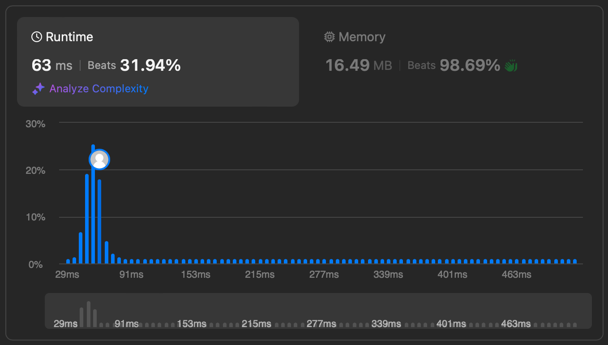

# Leetcode_Longest_Substring_Without_Repeating_Characters
>## Описание проекта
>Задана строка s, найдите длину самой длинной подстроки без повторяющихся символов.
>
>Ссылка на задачу: <https://leetcode.com/problems/longest-substring-without-repeating-characters/>

>## результаты работы кода
>
>

>## Стек
> 1. Python3
> 2. Makefile

>### Автор
>[Михаил Пономарёв](https://github.com/bizarrol423)
